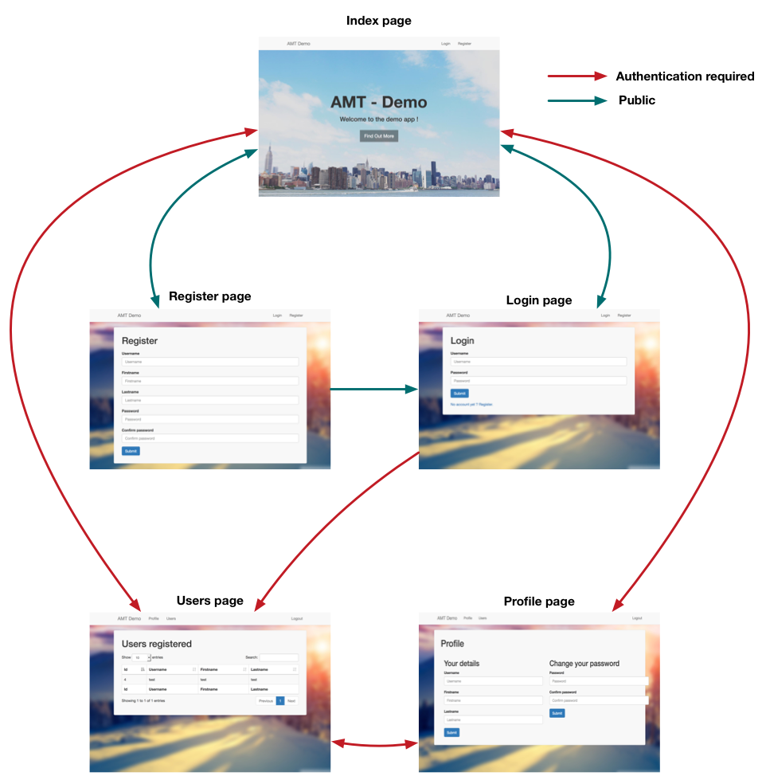
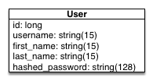
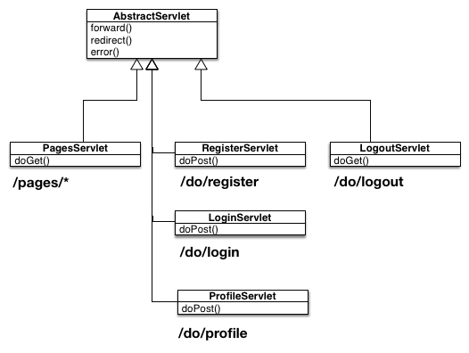
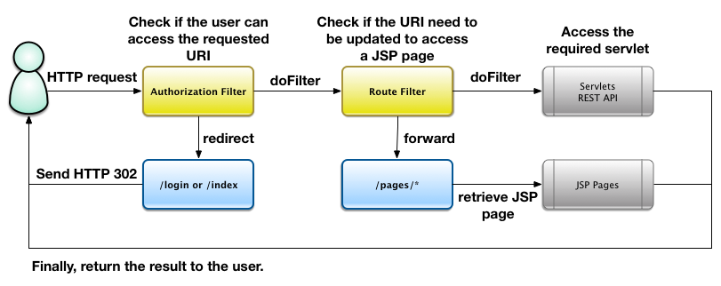
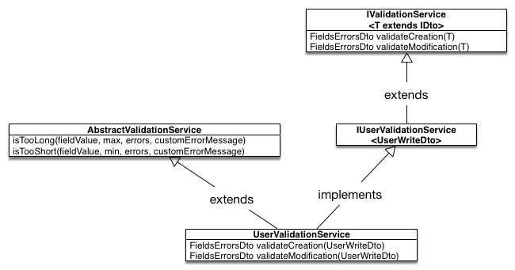
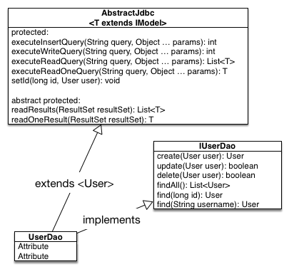

# AMT Lab 1 - Demo project

## Introduction

In this lab, students were asked to develop a Java EE application deployed on wildfly or glassfish through Docker containers.

There is the list of main features asked:

- Index page
- Login page
- Register page
- Private users page
- Logout feature
- REST API to manage users
- JDBC storage in MySQL server for the users
- Use of Servlets and Filters
- Defining a model for the users
- Defining one or more Data Transfer Object (DTO) for the REST representation of users
- Basic validations of input fields from the web pages and for the REST API
- Managing the HTTP Session for a connected (authenticated) user

For the web part of the application, there is the navigation flow expected:



The following pages are available when the user is not connected (not authenticated):

  - Index
  - Login
  - Register

The following pages are available when the user is connected (authenticated):

  - Index
  - Users
  - Profile
  - Logout (in fact not a real page)

A user is defined with at least the following informations:

  - Numerical ID (ideally, was not accounted as an error if not present)
  - Username or email
  - Password

It was encouraged to add more information such firstname, lastname to have more data to work with.

In this demonstration project, the user is defined in the database with the following schema:



The password is hashed to add a little complexity as a demonstration to use multiple session beans. It helps to split some business logic from the database logic.

## Deploying the app

### Requirements

To run Docker containers of this demonstration, you need to install a Docker environment on your computer.

- Docker 1.1.12
- Docker-compose  1.7.1

To build the project (required to run the deployment script), you need to install Java SDK and tools.

- Maven 3.3.9
- Java 8

### Deployment

1. Clone this repository
2. Make sure you have a terminal session opened in the root directory of this repository cloned
3. Run the following command:

  ```bash
  $> ./deploy.sh
  ```

4. Open a browser and go to `<ip>:9090/AmtDemoProject-1.0-SNAPSHOT`

**Remark**: The `<ip>` depends on how you have installed and configured Docker. It can be `localhost` if you run Docker for Mac/Windows or run natively on linux. It can also be `192.168.99.100` if you have a default Docker machine.

### Detailed commands

If for any reason you prefer to do it manually instead of running the script, you can do the following:

#### Build the app

1. Clone or download the repo.
2. Go to the root of the directory and run:

  ```bash
  # Clean, build and package the application
  mvn clean package
  ```

#### Deploy the app

1. Still at the root of the directory, enter the following commands:

  ```bash
  # Copy the WARs to the wildfly docker image definition folders
  cp target/*.war images/widlfly/

  # Run the Docker topology and build the required images
  docker-compose up --build
  ```

## Test the Application

You will find a [Postman](https://www.getpostman.com/) script in the following folder [/test](/test).

There is three environment variables to configure (or you can import the environment file present in the same folder).

* host: The host ip (pre-configured: 192.168.99.100)
* port: The port (pre-configured: 9090)
* contextRoot: The base path of the application (pre-configured: AmtDemoProject-1.0-SNAPSHOT)

You should adapt the host value if you run the docker infrastructure with Docker for Mac/Windows.

Once you imported the script in Postman, you should be able to run the full test suite. The script will do all the CRUD operations on the users. The script can be run on a fresh deployed application or an application running for a while.

## Application architecture

### Servlets

The servlets are organized around two main activities:

  1. Serving web pages (GET request for JSP pages)
  2. Processing actions (POST request to submit forms)

There is the class organization:



GET request are generally bound to `/pages/*` and POST requests are generally bound `/do/*`. The `pages` is used to serve JSP pages and `do` to process actions.

In the class diagram, we can see all the servlet inherits from the `AbstractServlet`. It's a way to share some code between the servlets. It can be done differently with a utility class for example.

Servlets:

  - `PagesServlet`: Serve any JSP page
  - `LoginServlet`: Process login form and to manage the HTTP Session when login is successful and redirects to users page
  - `RegisterServlet`: Process the creation of a user and redirects when success to the login page
  - `ProfileServlet`: Process the update of the user details or password
  - `LogoutServlet`: Manage the HTTP Session (destroy it) and redirects to the index page

### JSP

The JSP files are located in [src/main/webapp/WEB-INF/pages](src/main/webapp/WEB-INF/pages). They are served through the `PagesServlet`. This servlet will use the Java Reflection to retrieve the known pages and serve the JSP for all the URI `/pages/*`. If a page does not exist, the 404 error page is returned.

### Filters

In addition to the servlets, the application uses web filters to enforce public/private part of the application. It is also used to redirect the user to the index page when some URL are used. In addition, we forbid the access of some public pages like register/login pages when the user is authenticated.

To work correctly, the filters need to be configured in a certain order. It is not possible to define an order through the `@WebFilter` annotation. To enforce the execution order of the filters, we need to define the mappings in the `web.xml`.

```xml
<!-- First -->
<filter-mapping>
  <filter-name>AuthorizationFilter</filter-name>
  <url-pattern>/*</url-pattern>
</filter-mapping>

<!-- Second -->
<filter-mapping>
  <filter-name>RouteFilter</filter-name>
  <url-pattern>/*</url-pattern>
</filter-mapping>
```

We start the filtering of the request by the authorization filter which takes care to continue the filter chain when the user is authenticated (or not) depending of the authorization configuration. Then we check the routing.

The following diagram show the filtering workflow:



### Authorizations

The authorization mechanism use a filter (as described in the previous section) to catch every request (GET, POST, ...) that reach the application. For that, we use a pattern `/*` for the filter. By default, all the requests are blocked. The filter has a white list of public pages that a non-authenticated user can access. There are few examples of opened paths:

  - /
  - /index
  - /pages/index
  - /pages/login
  - /pages/register
  - /do/login
  - /do/register
  - /static/* (all the static content like css, js, images)
  - /api/* (all the API is open)

Once a user is authenticated, we want to deny few paths to avoid some troubles like double authentication, registration when a user is already registered. The following paths cannot be accessed by authenticated users:

  - /pages/login and /do/login
  - /pages/register and /do/register

### Validations

The application use a custom validation system that is really simplified from usual existing solutions. Java EE offer a JSR for validation. As it is not in the scope of the current state of the course, we decided to just create a validation mechanism through session beans.

The following class diagram shows the validation classes for a User:



There an interface `IValidationService` that aims to be implemented by all the validation services. This interface offers the possibility to validate a DTO for a creation or a modification. The `AbstractValidationService` offers shared mechanism to proceed the validations.

### Services

In our simple application, we do not have a lot of business logic. But we can consider the security part as business logic. For example, checking the credentials given by a user can be considered as security business logic. It is not a good idea to put this logic into the `UserDao` as this manager is used to communicate with the database and only has this purpose.

So, in our application, we the `ISecurityService` with its implementation `SecurityService` that offers two methods `checkCredentials` and `hashPassword`. The first method validate that the credentials given by a user are valid and the second is used to hash a clear password.

In addition, we have the `IMessageService/MessageService` which a `@Singleton` session bean. This service aims to provide a mechanism to let the possibility to transfer messages between two HTTP requests without using with the HTTP session. This also a use case to demonstrate the `singleton` pattern in such application.

### DAO/Managers

In this demo application, we have a link to a MySQL database. We directly use JDBC driver to do our queries to the database. JPA was not an option for the students as they do not learned the subject before the lab deadline.

The following classes are involved in the job to manipulate the data from and to the database:



The `AbstractJdbc` class is a wrapper around JDBC driver operations to facilitate the usage of JDBC for CRUD operations in various DAOs. In this application, we have only one DAO which is the `UserDao`. It also reduce the code duplication and helps to keep a `UserDao` more readable about the work done in the DAO.

The `AbstractJdbc` offers different query operations:

  - `executeInsertQuery` used to create a new record in the database and return the generated `ID` (do not use this operation for bulk insert)
  - `executeWriteQuery` used to update/delete a record in the database. Return the number of records affected by the write operation. (do not use this operation for bulk update/delete)
  - `executeReadQuery` used to select one or more records from the database. Return a list of model
  - `executeReadOneQuery` used to select only one record from the database. Return a model or throw exceptions like `NoResultException` or `NonUniqueResultException`

In addition of the JDBC classes, there is also different exception that can be thrown from the `AbstractJdbc`:

  - `NoResultException`: used when we expect to get at least one record from the database but there was no result retrieved
  - `NonUniqueResultException`: used when we expect to get one and only one record from the database and there was too many records retrieved from the database
  - `QueryException`: used when there is SQLException (wrapper) or any error that we want to wrap in a `RuntimeException`

A good example for `NoResultException` and `NonUniqueResultException` is when you want to find a record by its ID. The ID is supposed to be unique and then if there is more than one result, we have a problem. We also make the assumption that when we do a `findById` we expect to get the resulted record from the database.

#### Database filtering

In this section, we will present something quite over-engineered. We put in place a system to do a mapping between kind of human friendly names for data filtering to the DB column names for a model.

For example, we have the model class `User` with an attribute name `firstname` which we consider human readable. We have for this model and attribute the DB column name `first_name` which we do not consider human readable and we do not want to expose directly through our API.

In addition of this mappings, we also offer the possibility to easily retrieve all the filter names from a model class. This is used to do the validation of the query parameters `fieldName` and `fieldValue` for the `GET /users` for example.

To achieve this goal, we created an annotation class called `FilterName` which is used on the attributes of the class `User`. Example: 

```java
public class User {
  private long id;

  @FilterName
  private String username;

  @FilterName("first_name")
  private String firstname;

  @FilterName("last_name")
  private String lastname;

  ...
}
```  

With this approach, we can call our API like that: `GET /users?fieldName=firstname&fieldValue=bob` which will result in a SQL query like `SELECT * FROM users WHERE firstname LIKE '%bob%'`.

Our mechanism can only set one filter at a time and is quite limited but it is a good demonstration of what we can do with annotations and the Java Reflexion. See that feature as an example of what can be done not for real use case to follow as we know it exists a predicate API in the Java EE world.

In bonus, our mechanism prevent the SQL Injections issue as we can only use existing names which are constraints in the `AbstractJdbc` class through a validation phase.

A downside of this solution at the time is that we use the attribute names of the model class which are therefore exposed directly through our API. An improvement could be done through the `FilterName` annotation with a bidirectional mapping directly specified in the annotation. In this case, the attribute names will not be exposed directly anymore.

The solution in place uses 3 classes which are `Filter`, `FilterName` and `FilterUtils` (plus additional exception and mapper classes for error handling). The `FilterName` annotation has already been discussed. The `Filter` class is used to transfer the `fieldName` and `fieldValue` from the REST layer to the DAO layer. And finally, the `FilterUtils` class is used to do the logic around the Java Reflection to retrieve and validate the field names.

### Data transfer object (DTO)

For the transfer objects used in the REST API, we have an interface `IDto` which is used to mark all the DTO with it. It helps to manipulate the DTOs.

We have two families of DTO in this application:

  - Errors related DTOs
  - User related DTOs

The `MessageCollectionDto` and `ErrorDto` are used to represent the validation errors in the API but can alse be used elsewhere. In our case, we use these DTOs in the servlets for the form user inputs validation.

The `UserReadDto` and `UserWriteDto` are used to represent the user information in the REST API. The difference between the `read` and the `write` DTOs consist of the data that are represented. In the case of a user, we do not want to represent the password/hashedPassword in the DTOs we return in the API. And when we create/update a user we want to be able to accept a password/passwordConfirmation. Therefore, we use the `read` user DTO to output the details of the users through our API and we use the `write` user DTO to accept user details to create or update a user.

### Models

In our application, we have only one model which is the `User`. The user has already been described earlier in this documentation. It contains the fields: `id`, `username`, `firstname`, `lastname` and `hashedPassword`.

The interface `IModel` is also a marker for any model we want to define.

As the `ID` from the database is managed by the database itself, we do not want to let the possibility to modify the value of the `ID` once it has been created. Therefore, we use the Java Reflection to set the ID of a user when we do read queries.

### Exception mappers

We use two exception mappers in our API. These mappers helps to make the API more easy to write. For example, we use a `NoResultExceptionMapper` to return a 404 HTTP response. In our case, this means that we have not found a user corresponding to an `ID`.

### REST API

Finally, we have the REST API which only define a `UsersResource` on `/api/users`. The `UsersResource` class inherits from `AbstractResource` which offers several helpers methods to build responses like not found or no content.

For more details about the REST API, please read the <a href="https://softeng-heigvd.github.io/amt-2016-lab1-solution/" target="_blank">online API documentation</a>.
